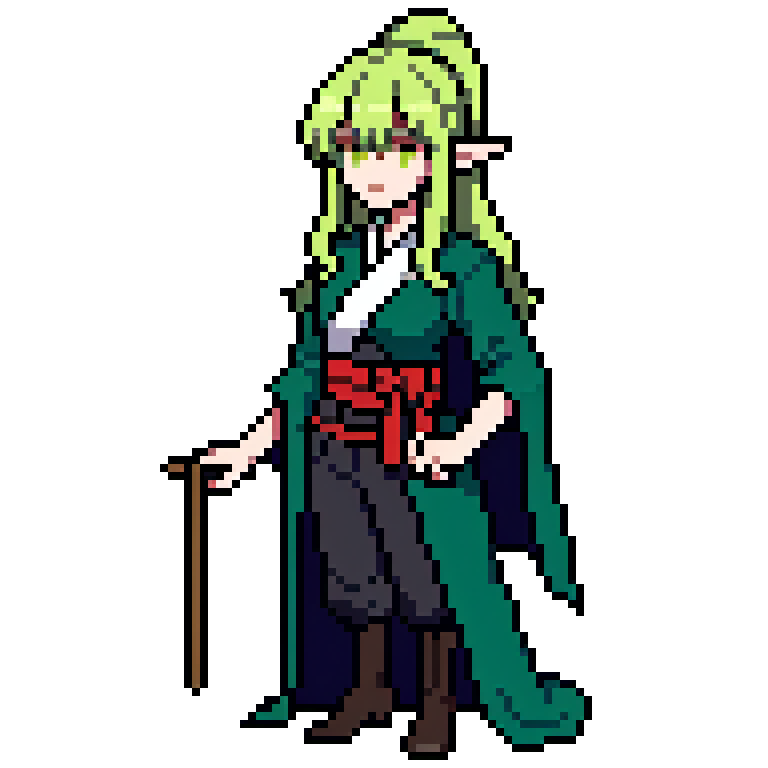
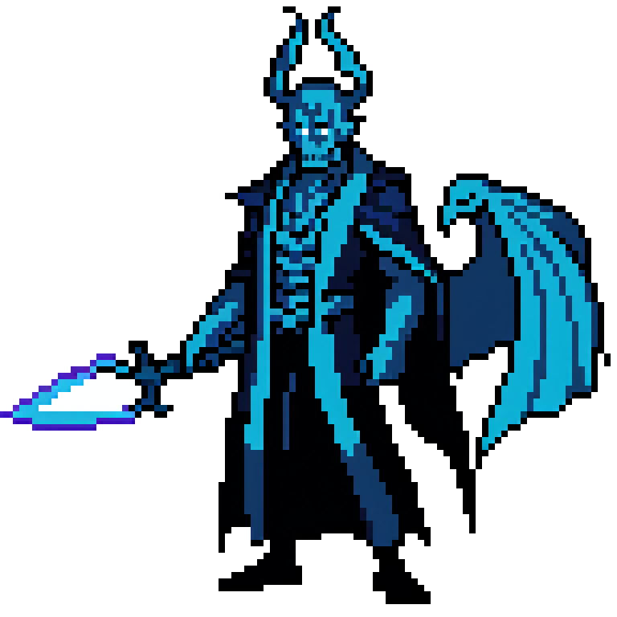

# Alan Fabricio Lozano

  
  
  
  

  <strong>Software and Video Game Engineer.</strong> 
  <strong>Developing Everlasting Pixel Experiences.</strong>

---

## ✨ About me

I design and build interactive experiences where magic, systems, and player emotion meet.

**My work focuses on:**
- Software engineering for interactive products
- Video game design and mechanics
- Pixel-art fantasy worlds and character-driven stories
- RPG systems, progression loops, and idle-game feel
- Creativity through code, UI, animation, and gameplay structure

*I believe great games are built when engineering, art, and storytelling move together.*

---

## 🧙 Pixel Party of Magic

<table>
  <tr>
    <td align="center" width="200">
       
        
      <strong>Dark Paladin</strong> 
      Shadow Shield
        
    </td>
    <td align="center" width="200">
       
        
      <strong>Sage</strong> 
      Arcane Wisdom
        
    </td>
    <td align="center" width="200">
       
        
      <strong>Wraith</strong> 
      Soul Reaper
        
    </td>
  </tr>
</table>

---

## 🛠️ Class Skills & Tech Stack

### Core GameDev Languages

  
  
  
  
  

### Engines, Frameworks & Web

  
  
  
  
  

### Tools & Version Control

  
  
  

---

## 🌌 Current Focus

- 🗡️ Building stronger idle RPG and fantasy game systems
- 🎨 Designing polished pixel-art combat experiences
- 🔄 Creating playable game loops with progression and feedback
- 🌐 Turning prototypes into long-term interactive worlds
- 📜 Blending engineering and visual storytelling into memorable games

---

---

## 🚀 Featured Work

### 🧠 Featured Repository

<table>
  <tr>
    <td width="100%">
      <h3>
        <a href="https://github.com/alanfabzlab/Developer-Knowledge-Base">🧠 Developer-Knowledge-Base</a>
      </h3>
      

        
        
        
      

      

        <i>A structured, step-by-step knowledge base documenting programming languages, core computer science foundations, software architecture patterns, and hands-on exercises using Map of Content (MOC) methodology.</i>
      

      

        👉 <b><a href="https://github.com/alanfabzlab/Developer-Knowledge-Base">Explore the Vault &rarr;</a></b>
      

    </td>
  </tr>
</table>

 

  
<b>🏰 Click to expand other projects & prototypes</b>

   
  <ul>
    <li><b>Arcane Idle Dominion:</b> Core progression mechanics and idle RPG loop setup.</li>
    <li><b>Pixel Fantasy Battle Prototypes:</b> Turn-based and real-time combat experiments.</li>
    <li><b>Browser Game Mechanics:</b> Canvas-based rendering, UI structures, and lightweight systems.</li>
    <li><b>RPG UI & UX Concepting:</b> Mobile-friendly layouts, inventory systems, and skill trees.</li>
  </ul>

---

## 📊 Player Stats & GitHub Activity

---

## 🤝 Connect

 

